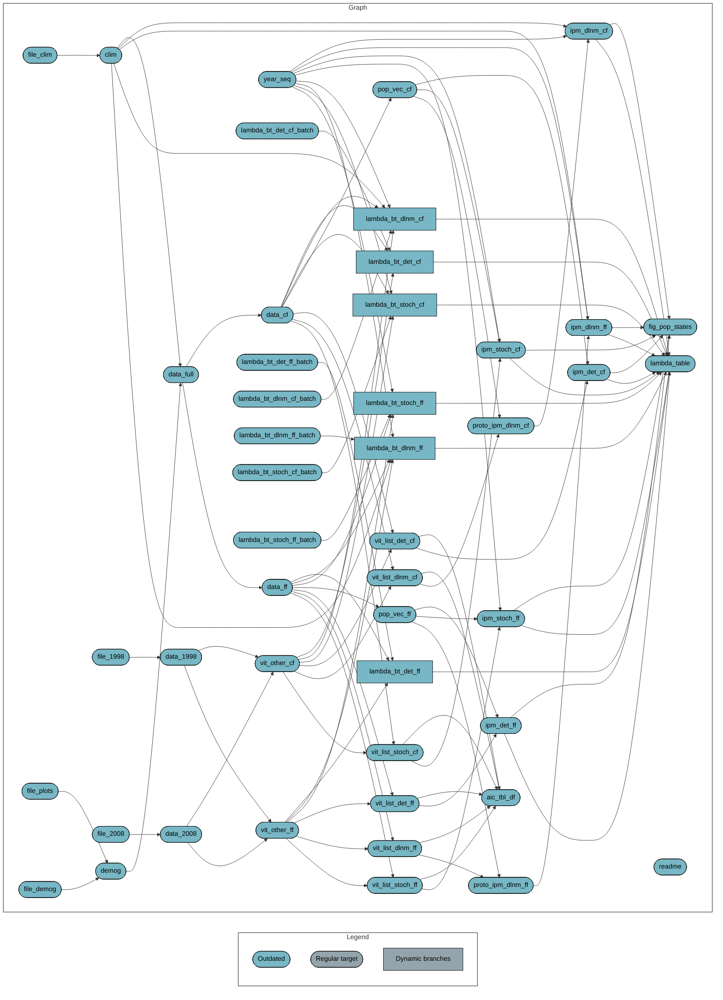

<!-- README.md is generated from README.Rmd. Please edit that file -->

<!-- badges: start -->

<!-- DOI badges go here -->

<!-- badges: end -->

This repository contains data and code for a manuscript by Eric Scott,
María Uriarte, and Emilio Bruna tentatively titled: *Context-dependent
consequences of including lagged effects in demographic models*. We
investigated the consequences of including lagged effects (such as those
modeled by distributed lag non-linear models) into population models
(integral projection models, IPMs). We compared population growth rates
projected with deterministic IPMs, stochastic IPMs (using
‘matrix-shuffling’), and stochastic IPMs with lagged effects.

The most recent draft of the manuscript is available
[here](https://brunalab.github.io/lagged-ipms/docs/ipm_comparison_ms.pdf).

# Reproducibility

This research compendium has been developed using the statistical
programming language R. To work with the compendium, you will need
installed on your computer the [R
software](https://cloud.r-project.org/) (v4.3 for best compatibility)
itself and [RStudio
Desktop](https://rstudio.com/products/rstudio/download/).

You can download the compendium as a zip file from from this URL:
[master.zip](/archive/master.zip).

To run the compendium and reproduce all outputs:

- Open the project in RStudio by double-clicking the `.Rproj` file.
- This project uses `renv` for package management, which should be
  installed automatically when opening the project. Run
  `renv::restore()` to install all required packages (this will have the
  highest likelihood of succeeding if run on R v4.3.0).
- You can run `renv::deactivate()` if you want to turn of `renv` but
  keep the lockfile as a record of package versions used.
- This project uses `targets` for workflow management. The functions
  used in the project are defined in `R/` and the steps are defined in
  `_targets.R` and summarized in the schematic below. Run
  `targets::tar_make()` or `targets::tar_make_clustermq()` from the R
  console to run all code and produce all outputs.

tar_source() only sources R scripts. Ignoring non-R files: R/.gitkeep +
lambda_bt_det_cf declared \[5 branches\] + lambda_bt_dlnm_cf declared
\[500 branches\] + lambda_bt_stoch_cf declared \[5 branches\] +
lambda_bt_det_ff declared \[5 branches\] + lambda_bt_stoch_ff declared
\[5 branches\] + lambda_bt_dlnm_ff declared \[500 branches\]

``` mermaid
graph LR
  style Legend fill:#FFFFFF00,stroke:#000000;
  style Graph fill:#FFFFFF00,stroke:#000000;
  subgraph Legend
    x2db1ec7a48f65a9b(["Outdated"]):::outdated
    xd03d7c7dd2ddda2b(["Regular target"]):::none
    x6f7e04ea3427f824["Dynamic branches"]:::none
  end
  subgraph Graph
    direction LR
    xebd4655b0c2ad5b7(["vit_list_stoch_ff"]):::outdated --> xd86ad8a14052b127(["aic_tbl_df"]):::outdated
    xf5ae41be40a20de5(["vit_list_stoch_cf"]):::outdated --> xd86ad8a14052b127(["aic_tbl_df"]):::outdated
    x897a86730224236f(["vit_list_det_cf"]):::outdated --> xd86ad8a14052b127(["aic_tbl_df"]):::outdated
    xe492e7136a847abe(["vit_list_dlnm_ff"]):::outdated --> xd86ad8a14052b127(["aic_tbl_df"]):::outdated
    x14d4fd4347f01489(["vit_list_det_ff"]):::outdated --> xd86ad8a14052b127(["aic_tbl_df"]):::outdated
    xcbaf1465d19cff85(["vit_list_dlnm_cf"]):::outdated --> xd86ad8a14052b127(["aic_tbl_df"]):::outdated
    x2ef90b72a613e0ee(["file_clim"]):::outdated --> x644d99c459f6caa5(["clim"]):::outdated
    xaa9fd089aea8e50f(["file_1998"]):::outdated --> x4a9ce7f36e333d4a(["data_1998"]):::outdated
    x3fedaeaba501a0ee(["file_2008"]):::outdated --> x910f97abe8dad3e1(["data_2008"]):::outdated
    xbd6a4f6f8449f967(["data_full"]):::outdated --> x2fca12f73659cbfb(["data_cf"]):::outdated
    xbd6a4f6f8449f967(["data_full"]):::outdated --> xfad7f4702311e2f5(["data_ff"]):::outdated
    x644d99c459f6caa5(["clim"]):::outdated --> xbd6a4f6f8449f967(["data_full"]):::outdated
    xef3d3135cfbe230e(["demog"]):::outdated --> xbd6a4f6f8449f967(["data_full"]):::outdated
    x80310e7930ac921f(["file_plots"]):::outdated --> xef3d3135cfbe230e(["demog"]):::outdated
    xd6c299285d38bc95(["file_demog"]):::outdated --> xef3d3135cfbe230e(["demog"]):::outdated
    x0ad03462f512fcae(["ipm_dlnm_ff"]):::outdated --> xbb3a8a41c8824fd5(["fig_pop_states"]):::outdated
    xaeefff597618a75b(["ipm_det_cf"]):::outdated --> xbb3a8a41c8824fd5(["fig_pop_states"]):::outdated
    xef98d5b967957e11(["ipm_det_ff"]):::outdated --> xbb3a8a41c8824fd5(["fig_pop_states"]):::outdated
    x04f53fee37c65025(["ipm_stoch_ff"]):::outdated --> xbb3a8a41c8824fd5(["fig_pop_states"]):::outdated
    xe9f1065d0448c6f8(["ipm_dlnm_cf"]):::outdated --> xbb3a8a41c8824fd5(["fig_pop_states"]):::outdated
    x11d391afdb9927e4(["ipm_stoch_cf"]):::outdated --> xbb3a8a41c8824fd5(["fig_pop_states"]):::outdated
    x897a86730224236f(["vit_list_det_cf"]):::outdated --> xaeefff597618a75b(["ipm_det_cf"]):::outdated
    xac90971809b66999(["pop_vec_cf"]):::outdated --> xaeefff597618a75b(["ipm_det_cf"]):::outdated
    x14d4fd4347f01489(["vit_list_det_ff"]):::outdated --> xef98d5b967957e11(["ipm_det_ff"]):::outdated
    x09567539de6c9fef(["pop_vec_ff"]):::outdated --> xef98d5b967957e11(["ipm_det_ff"]):::outdated
    x644d99c459f6caa5(["clim"]):::outdated --> xe9f1065d0448c6f8(["ipm_dlnm_cf"]):::outdated
    x78f4bb1e88dab3ea(["proto_ipm_dlnm_cf"]):::outdated --> xe9f1065d0448c6f8(["ipm_dlnm_cf"]):::outdated
    x06f55b705e604f4a(["year_seq"]):::outdated --> xe9f1065d0448c6f8(["ipm_dlnm_cf"]):::outdated
    x06f55b705e604f4a(["year_seq"]):::outdated --> x0ad03462f512fcae(["ipm_dlnm_ff"]):::outdated
    x644d99c459f6caa5(["clim"]):::outdated --> x0ad03462f512fcae(["ipm_dlnm_ff"]):::outdated
    x8cc7ac1f645b71da(["proto_ipm_dlnm_ff"]):::outdated --> x0ad03462f512fcae(["ipm_dlnm_ff"]):::outdated
    xac90971809b66999(["pop_vec_cf"]):::outdated --> x11d391afdb9927e4(["ipm_stoch_cf"]):::outdated
    xf5ae41be40a20de5(["vit_list_stoch_cf"]):::outdated --> x11d391afdb9927e4(["ipm_stoch_cf"]):::outdated
    x06f55b705e604f4a(["year_seq"]):::outdated --> x11d391afdb9927e4(["ipm_stoch_cf"]):::outdated
    x06f55b705e604f4a(["year_seq"]):::outdated --> x04f53fee37c65025(["ipm_stoch_ff"]):::outdated
    xebd4655b0c2ad5b7(["vit_list_stoch_ff"]):::outdated --> x04f53fee37c65025(["ipm_stoch_ff"]):::outdated
    x09567539de6c9fef(["pop_vec_ff"]):::outdated --> x04f53fee37c65025(["ipm_stoch_ff"]):::outdated
    x5d23a2913d4a0549(["lambda_bt_det_cf_batch"]):::outdated --> x26a20619c20d7070["lambda_bt_det_cf"]:::outdated
    xdab15a36e1ac628a(["vit_other_cf"]):::outdated --> x26a20619c20d7070["lambda_bt_det_cf"]:::outdated
    x2fca12f73659cbfb(["data_cf"]):::outdated --> x26a20619c20d7070["lambda_bt_det_cf"]:::outdated
    xfad7f4702311e2f5(["data_ff"]):::outdated --> x4f683f8931d2a29b["lambda_bt_det_ff"]:::outdated
    xca03ba09c6104674(["vit_other_ff"]):::outdated --> x4f683f8931d2a29b["lambda_bt_det_ff"]:::outdated
    xab66e861332c75c8(["lambda_bt_det_ff_batch"]):::outdated --> x4f683f8931d2a29b["lambda_bt_det_ff"]:::outdated
    xdab15a36e1ac628a(["vit_other_cf"]):::outdated --> xd805c6ec10296fdd["lambda_bt_dlnm_cf"]:::outdated
    x06f55b705e604f4a(["year_seq"]):::outdated --> xd805c6ec10296fdd["lambda_bt_dlnm_cf"]:::outdated
    x644d99c459f6caa5(["clim"]):::outdated --> xd805c6ec10296fdd["lambda_bt_dlnm_cf"]:::outdated
    x3e4b74d2bfead5ed(["lambda_bt_dlnm_cf_batch"]):::outdated --> xd805c6ec10296fdd["lambda_bt_dlnm_cf"]:::outdated
    x2fca12f73659cbfb(["data_cf"]):::outdated --> xd805c6ec10296fdd["lambda_bt_dlnm_cf"]:::outdated
    xca03ba09c6104674(["vit_other_ff"]):::outdated --> x69ff09c053ec832a["lambda_bt_dlnm_ff"]:::outdated
    x15ae32b06c294ecf(["lambda_bt_dlnm_ff_batch"]):::outdated --> x69ff09c053ec832a["lambda_bt_dlnm_ff"]:::outdated
    xfad7f4702311e2f5(["data_ff"]):::outdated --> x69ff09c053ec832a["lambda_bt_dlnm_ff"]:::outdated
    x644d99c459f6caa5(["clim"]):::outdated --> x69ff09c053ec832a["lambda_bt_dlnm_ff"]:::outdated
    x06f55b705e604f4a(["year_seq"]):::outdated --> x69ff09c053ec832a["lambda_bt_dlnm_ff"]:::outdated
    xcd03fda18ba0ec72(["lambda_bt_stoch_cf_batch"]):::outdated --> x84d46e9b4adcf058["lambda_bt_stoch_cf"]:::outdated
    x06f55b705e604f4a(["year_seq"]):::outdated --> x84d46e9b4adcf058["lambda_bt_stoch_cf"]:::outdated
    xdab15a36e1ac628a(["vit_other_cf"]):::outdated --> x84d46e9b4adcf058["lambda_bt_stoch_cf"]:::outdated
    x2fca12f73659cbfb(["data_cf"]):::outdated --> x84d46e9b4adcf058["lambda_bt_stoch_cf"]:::outdated
    xca03ba09c6104674(["vit_other_ff"]):::outdated --> x60fbc84484522bae["lambda_bt_stoch_ff"]:::outdated
    xfad7f4702311e2f5(["data_ff"]):::outdated --> x60fbc84484522bae["lambda_bt_stoch_ff"]:::outdated
    x395b13a272516866(["lambda_bt_stoch_ff_batch"]):::outdated --> x60fbc84484522bae["lambda_bt_stoch_ff"]:::outdated
    x06f55b705e604f4a(["year_seq"]):::outdated --> x60fbc84484522bae["lambda_bt_stoch_ff"]:::outdated
    xaeefff597618a75b(["ipm_det_cf"]):::outdated --> x76f035a61e7630dc(["lambda_table"]):::outdated
    xef98d5b967957e11(["ipm_det_ff"]):::outdated --> x76f035a61e7630dc(["lambda_table"]):::outdated
    x26a20619c20d7070["lambda_bt_det_cf"]:::outdated --> x76f035a61e7630dc(["lambda_table"]):::outdated
    x11d391afdb9927e4(["ipm_stoch_cf"]):::outdated --> x76f035a61e7630dc(["lambda_table"]):::outdated
    x04f53fee37c65025(["ipm_stoch_ff"]):::outdated --> x76f035a61e7630dc(["lambda_table"]):::outdated
    xd805c6ec10296fdd["lambda_bt_dlnm_cf"]:::outdated --> x76f035a61e7630dc(["lambda_table"]):::outdated
    x84d46e9b4adcf058["lambda_bt_stoch_cf"]:::outdated --> x76f035a61e7630dc(["lambda_table"]):::outdated
    x4f683f8931d2a29b["lambda_bt_det_ff"]:::outdated --> x76f035a61e7630dc(["lambda_table"]):::outdated
    xe9f1065d0448c6f8(["ipm_dlnm_cf"]):::outdated --> x76f035a61e7630dc(["lambda_table"]):::outdated
    x0ad03462f512fcae(["ipm_dlnm_ff"]):::outdated --> x76f035a61e7630dc(["lambda_table"]):::outdated
    x60fbc84484522bae["lambda_bt_stoch_ff"]:::outdated --> x76f035a61e7630dc(["lambda_table"]):::outdated
    x69ff09c053ec832a["lambda_bt_dlnm_ff"]:::outdated --> x76f035a61e7630dc(["lambda_table"]):::outdated
    x2fca12f73659cbfb(["data_cf"]):::outdated --> xac90971809b66999(["pop_vec_cf"]):::outdated
    xfad7f4702311e2f5(["data_ff"]):::outdated --> x09567539de6c9fef(["pop_vec_ff"]):::outdated
    xac90971809b66999(["pop_vec_cf"]):::outdated --> x78f4bb1e88dab3ea(["proto_ipm_dlnm_cf"]):::outdated
    xcbaf1465d19cff85(["vit_list_dlnm_cf"]):::outdated --> x78f4bb1e88dab3ea(["proto_ipm_dlnm_cf"]):::outdated
    x09567539de6c9fef(["pop_vec_ff"]):::outdated --> x8cc7ac1f645b71da(["proto_ipm_dlnm_ff"]):::outdated
    xe492e7136a847abe(["vit_list_dlnm_ff"]):::outdated --> x8cc7ac1f645b71da(["proto_ipm_dlnm_ff"]):::outdated
    x2fca12f73659cbfb(["data_cf"]):::outdated --> x897a86730224236f(["vit_list_det_cf"]):::outdated
    xdab15a36e1ac628a(["vit_other_cf"]):::outdated --> x897a86730224236f(["vit_list_det_cf"]):::outdated
    xca03ba09c6104674(["vit_other_ff"]):::outdated --> x14d4fd4347f01489(["vit_list_det_ff"]):::outdated
    xfad7f4702311e2f5(["data_ff"]):::outdated --> x14d4fd4347f01489(["vit_list_det_ff"]):::outdated
    x2fca12f73659cbfb(["data_cf"]):::outdated --> xcbaf1465d19cff85(["vit_list_dlnm_cf"]):::outdated
    xdab15a36e1ac628a(["vit_other_cf"]):::outdated --> xcbaf1465d19cff85(["vit_list_dlnm_cf"]):::outdated
    xfad7f4702311e2f5(["data_ff"]):::outdated --> xe492e7136a847abe(["vit_list_dlnm_ff"]):::outdated
    xca03ba09c6104674(["vit_other_ff"]):::outdated --> xe492e7136a847abe(["vit_list_dlnm_ff"]):::outdated
    xdab15a36e1ac628a(["vit_other_cf"]):::outdated --> xf5ae41be40a20de5(["vit_list_stoch_cf"]):::outdated
    x2fca12f73659cbfb(["data_cf"]):::outdated --> xf5ae41be40a20de5(["vit_list_stoch_cf"]):::outdated
    xfad7f4702311e2f5(["data_ff"]):::outdated --> xebd4655b0c2ad5b7(["vit_list_stoch_ff"]):::outdated
    xca03ba09c6104674(["vit_other_ff"]):::outdated --> xebd4655b0c2ad5b7(["vit_list_stoch_ff"]):::outdated
    x910f97abe8dad3e1(["data_2008"]):::outdated --> xdab15a36e1ac628a(["vit_other_cf"]):::outdated
    x4a9ce7f36e333d4a(["data_1998"]):::outdated --> xdab15a36e1ac628a(["vit_other_cf"]):::outdated
    x4a9ce7f36e333d4a(["data_1998"]):::outdated --> xca03ba09c6104674(["vit_other_ff"]):::outdated
    x910f97abe8dad3e1(["data_2008"]):::outdated --> xca03ba09c6104674(["vit_other_ff"]):::outdated
    xc11069275cfeb620(["readme"]):::outdated
  end
  classDef outdated stroke:#000000,color:#000000,fill:#78B7C5;
  classDef none stroke:#000000,color:#000000,fill:#94a4ac;
```

There is some additional technical information for collaborators on the
[‘notes for collaborators’
page](https://brunalab.github.io/lagged-ipms/notes/index.html).

### NOTES:

- The targets `lambda_bt_dlnm_ff` and `lambda_bt_dlnm_cf` will take a
  very long time to run (days), so you may want to comment those out
  before attempting to reproduce results.
- If you want to make use of HPC, follow instructions
  [here](https://github.com/BrunaLab/hipergator-targets-ssh) to
  customize templates and options.
