<!-- README.md is generated from README.Rmd. Please edit that file -->
<!-- badges: start -->

<!-- DOI badges go here -->
<!-- badges: end -->

This repository contains data and code for a manuscript by Eric Scott
and Emilio Bruna written for submission to The American Naturalist
tentatively titled: *Context-dependent consequences of including lagged
effects in demographic models*.

The idea here is to investigate the consequences of including lagged
effects (such as those modeled by distributed lag non-linear models)
into population models (integral projection models, IPMs). We’ll compare
population growth rates (lambda) with deterministic, stochastic (matrix
shuffling), and lagged effects IPMs.

The most recent draft of the manuscript is available
[here](https://brunalab.github.io/lagged-ipms/docs/paper.html).

[Notes for
collaborators](https://brunalab.github.io/lagged-ipms/notes/index.html)

# Roadmap

Before June 3:

-   [x] Finish building all IPMs
-   [x] Document functions and \_targets.R
-   [ ] Calculate bootstrapped 95% CIs around all lambdas
-   [x] Finish draft of methods section
-   [x] Draft tables & figures
-   [ ] Archive draft of code in Zenodo

Future:

-   [ ] Finish writing and revising
-   [ ] Submit

# Reproducibility

This research compendium has been developed using the statistical
programming language R. To work with the compendium, you will need
installed on your computer the [R
software](https://cloud.r-project.org/) itself and [RStudio
Desktop](https://rstudio.com/products/rstudio/download/).

You can download the compendium as a zip file from from this URL:
[master.zip](/archive/master.zip).

To run the compendium and reproduce all outputs:

-   Open the project in RStudio by double-clicking the `.Rproj` file.
-   This project uses `renv` for package management, which should be
    installed automatically when opening the project. Run
    `renv::restore()` to install all required packages.
-   This project uses `targets` for workflow management. The functions
    used in the project are defined in `R/` and the steps are defined in
    `_targets.R` and summarized in the schematic below. Run
    `targets::tar_make()` or `targets::tar_make_clustermq()` from the R
    console to run all code and produce all outputs.

``` mermaid
graph LR
  subgraph Legend
    x7420bd9270f8d27d([""Up to date""]):::uptodate --- x0a52b03877696646([""Outdated""]):::outdated
    x0a52b03877696646([""Outdated""]):::outdated --- x5b3426b4c7fa7dbc([""Started""]):::started
    x5b3426b4c7fa7dbc([""Started""]):::started --- xbf4603d6c2c2ad6b([""Stem""]):::none
    xbf4603d6c2c2ad6b([""Stem""]):::none --- x70a5fa6bea6f298d[""Pattern""]:::none
  end
  subgraph Graph
    x0da14f72b4678693(["clim"]):::uptodate --> xad111d9a6de9849e(["ipm_dlnm_cf"]):::uptodate
    x2d3035f88bd10bcd(["proto_ipm_dlnm_cf"]):::uptodate --> xad111d9a6de9849e(["ipm_dlnm_cf"]):::uptodate
    x30536edc201e3ffd(["year_seq"]):::uptodate --> xad111d9a6de9849e(["ipm_dlnm_cf"]):::uptodate
    x0aed4093939f76f0(["data_cf"]):::uptodate --> x4453e3f37167c52e["lambda_bt_det_cf"]:::uptodate
    x192af290b35c0804(["lambda_bt_det_cf_batch"]):::uptodate --> x4453e3f37167c52e["lambda_bt_det_cf"]:::uptodate
    x35acd3e9ec909b35(["vit_other_cf"]):::uptodate --> x4453e3f37167c52e["lambda_bt_det_cf"]:::uptodate
    x29048af5562090f1(["data_ff"]):::uptodate --> xa66f96c499139e98["lambda_bt_det_ff"]:::uptodate
    xf6ff88faae11e235(["lambda_bt_det_ff_batch"]):::uptodate --> xa66f96c499139e98["lambda_bt_det_ff"]:::uptodate
    x2bc7a3254fee9de8(["vit_other_ff"]):::uptodate --> xa66f96c499139e98["lambda_bt_det_ff"]:::uptodate
    xbc9b1e1f391d5dc4(["pop_vec_cf"]):::uptodate --> xd33e1ebf0b9525d1(["ipm_det_cf"]):::uptodate
    xdd4240eae739d5a0(["vit_list_det_cf"]):::uptodate --> xd33e1ebf0b9525d1(["ipm_det_cf"]):::uptodate
    xe3bb960370d9434e(["data_full"]):::uptodate --> x29048af5562090f1(["data_ff"]):::uptodate
    x7134afe7f02e398f(["file_demog"]):::uptodate --> x39bf1b937dd4e8d7(["demog"]):::uptodate
    xe90b608731259390(["file_plots"]):::uptodate --> x39bf1b937dd4e8d7(["demog"]):::uptodate
    x66b84036e0b3f448(["pop_vec_ff"]):::uptodate --> xc40105c4aa648483(["ipm_det_ff"]):::uptodate
    x3f5dae9caaa8de3d(["vit_list_det_ff"]):::uptodate --> xc40105c4aa648483(["ipm_det_ff"]):::uptodate
    x0da14f72b4678693(["clim"]):::uptodate --> xe3bb960370d9434e(["data_full"]):::uptodate
    x39bf1b937dd4e8d7(["demog"]):::uptodate --> xe3bb960370d9434e(["data_full"]):::uptodate
    xe3bb960370d9434e(["data_full"]):::uptodate --> x0aed4093939f76f0(["data_cf"]):::uptodate
    xd33e1ebf0b9525d1(["ipm_det_cf"]):::uptodate --> xb6337e8a83553fe6(["fig_pop_states"]):::uptodate
    xc40105c4aa648483(["ipm_det_ff"]):::uptodate --> xb6337e8a83553fe6(["fig_pop_states"]):::uptodate
    xad111d9a6de9849e(["ipm_dlnm_cf"]):::uptodate --> xb6337e8a83553fe6(["fig_pop_states"]):::uptodate
    x1d8bc3cd0f5951b5(["ipm_dlnm_ff"]):::uptodate --> xb6337e8a83553fe6(["fig_pop_states"]):::uptodate
    xf695dbbabfccbc3d(["ipm_stoch_cf"]):::uptodate --> xb6337e8a83553fe6(["fig_pop_states"]):::uptodate
    x29f5ff631139793b(["ipm_stoch_ff"]):::uptodate --> xb6337e8a83553fe6(["fig_pop_states"]):::uptodate
    x0aed4093939f76f0(["data_cf"]):::uptodate --> xdd4240eae739d5a0(["vit_list_det_cf"]):::uptodate
    x35acd3e9ec909b35(["vit_other_cf"]):::uptodate --> xdd4240eae739d5a0(["vit_list_det_cf"]):::uptodate
    x0da14f72b4678693(["clim"]):::uptodate --> x7bcacb1ba5f87767["lambda_bt_dlnm_ff"]:::outdated
    x29048af5562090f1(["data_ff"]):::uptodate --> x7bcacb1ba5f87767["lambda_bt_dlnm_ff"]:::outdated
    x49b27c873c2f8dac(["lambda_bt_dlnm_ff_batch"]):::uptodate --> x7bcacb1ba5f87767["lambda_bt_dlnm_ff"]:::outdated
    x2bc7a3254fee9de8(["vit_other_ff"]):::uptodate --> x7bcacb1ba5f87767["lambda_bt_dlnm_ff"]:::outdated
    x30536edc201e3ffd(["year_seq"]):::uptodate --> x7bcacb1ba5f87767["lambda_bt_dlnm_ff"]:::outdated
    x29048af5562090f1(["data_ff"]):::uptodate --> x3f5dae9caaa8de3d(["vit_list_det_ff"]):::uptodate
    x2bc7a3254fee9de8(["vit_other_ff"]):::uptodate --> x3f5dae9caaa8de3d(["vit_list_det_ff"]):::uptodate
    x29048af5562090f1(["data_ff"]):::uptodate --> x334e385c160dc2b0(["vit_list_stoch_ff"]):::uptodate
    x2bc7a3254fee9de8(["vit_other_ff"]):::uptodate --> x334e385c160dc2b0(["vit_list_stoch_ff"]):::uptodate
    x0da14f72b4678693(["clim"]):::uptodate --> xa9bca3978adf202f["lambda_bt_dlnm_cf"]:::outdated
    x0aed4093939f76f0(["data_cf"]):::uptodate --> xa9bca3978adf202f["lambda_bt_dlnm_cf"]:::outdated
    xd21a6a19ee553edf(["lambda_bt_dlnm_cf_batch"]):::uptodate --> xa9bca3978adf202f["lambda_bt_dlnm_cf"]:::outdated
    x35acd3e9ec909b35(["vit_other_cf"]):::uptodate --> xa9bca3978adf202f["lambda_bt_dlnm_cf"]:::outdated
    x30536edc201e3ffd(["year_seq"]):::uptodate --> xa9bca3978adf202f["lambda_bt_dlnm_cf"]:::outdated
    x0aed4093939f76f0(["data_cf"]):::uptodate --> xad89e792bf5290ce["lambda_bt_stoch_cf"]:::uptodate
    x678be229f95ec9d0(["lambda_bt_stoch_cf_batch"]):::uptodate --> xad89e792bf5290ce["lambda_bt_stoch_cf"]:::uptodate
    x35acd3e9ec909b35(["vit_other_cf"]):::uptodate --> xad89e792bf5290ce["lambda_bt_stoch_cf"]:::uptodate
    x30536edc201e3ffd(["year_seq"]):::uptodate --> xad89e792bf5290ce["lambda_bt_stoch_cf"]:::uptodate
    x29048af5562090f1(["data_ff"]):::uptodate --> x01cf57b49afd9c4e["lambda_bt_stoch_ff"]:::uptodate
    xee6ffe53df5db6e0(["lambda_bt_stoch_ff_batch"]):::uptodate --> x01cf57b49afd9c4e["lambda_bt_stoch_ff"]:::uptodate
    x2bc7a3254fee9de8(["vit_other_ff"]):::uptodate --> x01cf57b49afd9c4e["lambda_bt_stoch_ff"]:::uptodate
    x30536edc201e3ffd(["year_seq"]):::uptodate --> x01cf57b49afd9c4e["lambda_bt_stoch_ff"]:::uptodate
    x0aed4093939f76f0(["data_cf"]):::uptodate --> xd8d8a97005a4f298(["vit_list_stoch_cf"]):::uptodate
    x35acd3e9ec909b35(["vit_other_cf"]):::uptodate --> xd8d8a97005a4f298(["vit_list_stoch_cf"]):::uptodate
    xe928672abb7e71b0(["file_clim"]):::uptodate --> x0da14f72b4678693(["clim"]):::uptodate
    xe26f190063fc1e58(["data_1998"]):::uptodate --> x2bc7a3254fee9de8(["vit_other_ff"]):::uptodate
    xc95612f17d7e9c7f(["data_2008"]):::uptodate --> x2bc7a3254fee9de8(["vit_other_ff"]):::uptodate
    x40af609b921b83c4(["aic_tbl_df"]):::uptodate --> xc57125fbb988ce68(["paper"]):::outdated
    xb6337e8a83553fe6(["fig_pop_states"]):::uptodate --> xc57125fbb988ce68(["paper"]):::outdated
    x45cf3d9da0bb10ef(["lambda_table"]):::outdated --> xc57125fbb988ce68(["paper"]):::outdated
    xe26f190063fc1e58(["data_1998"]):::uptodate --> x35acd3e9ec909b35(["vit_other_cf"]):::uptodate
    xc95612f17d7e9c7f(["data_2008"]):::uptodate --> x35acd3e9ec909b35(["vit_other_cf"]):::uptodate
    x66b84036e0b3f448(["pop_vec_ff"]):::uptodate --> x3ec8f593bd525990(["proto_ipm_dlnm_ff"]):::uptodate
    x3a51b9522ce608f3(["vit_list_dlnm_ff"]):::uptodate --> x3ec8f593bd525990(["proto_ipm_dlnm_ff"]):::uptodate
    xbc9b1e1f391d5dc4(["pop_vec_cf"]):::uptodate --> xf695dbbabfccbc3d(["ipm_stoch_cf"]):::uptodate
    xd8d8a97005a4f298(["vit_list_stoch_cf"]):::uptodate --> xf695dbbabfccbc3d(["ipm_stoch_cf"]):::uptodate
    x30536edc201e3ffd(["year_seq"]):::uptodate --> xf695dbbabfccbc3d(["ipm_stoch_cf"]):::uptodate
    xbc9b1e1f391d5dc4(["pop_vec_cf"]):::uptodate --> x2d3035f88bd10bcd(["proto_ipm_dlnm_cf"]):::uptodate
    xe43dbf59794f4013(["vit_list_dlnm_cf"]):::uptodate --> x2d3035f88bd10bcd(["proto_ipm_dlnm_cf"]):::uptodate
    x66b84036e0b3f448(["pop_vec_ff"]):::uptodate --> x29f5ff631139793b(["ipm_stoch_ff"]):::uptodate
    x334e385c160dc2b0(["vit_list_stoch_ff"]):::uptodate --> x29f5ff631139793b(["ipm_stoch_ff"]):::uptodate
    x30536edc201e3ffd(["year_seq"]):::uptodate --> x29f5ff631139793b(["ipm_stoch_ff"]):::uptodate
    xd33e1ebf0b9525d1(["ipm_det_cf"]):::uptodate --> x45cf3d9da0bb10ef(["lambda_table"]):::outdated
    xc40105c4aa648483(["ipm_det_ff"]):::uptodate --> x45cf3d9da0bb10ef(["lambda_table"]):::outdated
    xad111d9a6de9849e(["ipm_dlnm_cf"]):::uptodate --> x45cf3d9da0bb10ef(["lambda_table"]):::outdated
    x1d8bc3cd0f5951b5(["ipm_dlnm_ff"]):::uptodate --> x45cf3d9da0bb10ef(["lambda_table"]):::outdated
    xf695dbbabfccbc3d(["ipm_stoch_cf"]):::uptodate --> x45cf3d9da0bb10ef(["lambda_table"]):::outdated
    x29f5ff631139793b(["ipm_stoch_ff"]):::uptodate --> x45cf3d9da0bb10ef(["lambda_table"]):::outdated
    x4453e3f37167c52e["lambda_bt_det_cf"]:::uptodate --> x45cf3d9da0bb10ef(["lambda_table"]):::outdated
    xa66f96c499139e98["lambda_bt_det_ff"]:::uptodate --> x45cf3d9da0bb10ef(["lambda_table"]):::outdated
    xa9bca3978adf202f["lambda_bt_dlnm_cf"]:::outdated --> x45cf3d9da0bb10ef(["lambda_table"]):::outdated
    x7bcacb1ba5f87767["lambda_bt_dlnm_ff"]:::outdated --> x45cf3d9da0bb10ef(["lambda_table"]):::outdated
    xad89e792bf5290ce["lambda_bt_stoch_cf"]:::uptodate --> x45cf3d9da0bb10ef(["lambda_table"]):::outdated
    x01cf57b49afd9c4e["lambda_bt_stoch_ff"]:::uptodate --> x45cf3d9da0bb10ef(["lambda_table"]):::outdated
    xdd4240eae739d5a0(["vit_list_det_cf"]):::uptodate --> x40af609b921b83c4(["aic_tbl_df"]):::uptodate
    x3f5dae9caaa8de3d(["vit_list_det_ff"]):::uptodate --> x40af609b921b83c4(["aic_tbl_df"]):::uptodate
    xe43dbf59794f4013(["vit_list_dlnm_cf"]):::uptodate --> x40af609b921b83c4(["aic_tbl_df"]):::uptodate
    x3a51b9522ce608f3(["vit_list_dlnm_ff"]):::uptodate --> x40af609b921b83c4(["aic_tbl_df"]):::uptodate
    xd8d8a97005a4f298(["vit_list_stoch_cf"]):::uptodate --> x40af609b921b83c4(["aic_tbl_df"]):::uptodate
    x334e385c160dc2b0(["vit_list_stoch_ff"]):::uptodate --> x40af609b921b83c4(["aic_tbl_df"]):::uptodate
    x336c9aae0b515bb1(["file_2008"]):::uptodate --> xc95612f17d7e9c7f(["data_2008"]):::uptodate
    x29048af5562090f1(["data_ff"]):::uptodate --> x66b84036e0b3f448(["pop_vec_ff"]):::uptodate
    x29048af5562090f1(["data_ff"]):::uptodate --> x3a51b9522ce608f3(["vit_list_dlnm_ff"]):::uptodate
    x2bc7a3254fee9de8(["vit_other_ff"]):::uptodate --> x3a51b9522ce608f3(["vit_list_dlnm_ff"]):::uptodate
    x0aed4093939f76f0(["data_cf"]):::uptodate --> xbc9b1e1f391d5dc4(["pop_vec_cf"]):::uptodate
    x0aed4093939f76f0(["data_cf"]):::uptodate --> xe43dbf59794f4013(["vit_list_dlnm_cf"]):::uptodate
    x35acd3e9ec909b35(["vit_other_cf"]):::uptodate --> xe43dbf59794f4013(["vit_list_dlnm_cf"]):::uptodate
    xba761c5e0ff843b6(["file_1998"]):::uptodate --> xe26f190063fc1e58(["data_1998"]):::uptodate
    x0da14f72b4678693(["clim"]):::uptodate --> x1d8bc3cd0f5951b5(["ipm_dlnm_ff"]):::uptodate
    x3ec8f593bd525990(["proto_ipm_dlnm_ff"]):::uptodate --> x1d8bc3cd0f5951b5(["ipm_dlnm_ff"]):::uptodate
    x30536edc201e3ffd(["year_seq"]):::uptodate --> x1d8bc3cd0f5951b5(["ipm_dlnm_ff"]):::uptodate
    x6e52cb0f1668cc22(["readme"]):::started --> x6e52cb0f1668cc22(["readme"]):::started
  end
  classDef uptodate stroke:#000000,color:#ffffff,fill:#354823;
  classDef outdated stroke:#000000,color:#000000,fill:#78B7C5;
  classDef started stroke:#000000,color:#000000,fill:#DC863B;
  classDef none stroke:#000000,color:#000000,fill:#94a4ac;
  linkStyle 0 stroke-width:0px;
  linkStyle 1 stroke-width:0px;
  linkStyle 2 stroke-width:0px;
  linkStyle 3 stroke-width:0px;
  linkStyle 102 stroke-width:0px;
```

### NOTES:

-   The targets `lambda_bt_dlnm_ff` and `lambda_bt_dlnm_cf` will take a
    very long time to run (days), so you may want to comment those out
    before attempting to reproduce results.
-   If you want to make use of HPC, follow instructions
    [here](https://github.com/BrunaLab/hipergator-targets-ssh) to
    customize templates and options.
